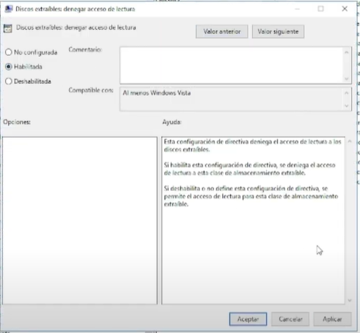

# Windows-Server-Hardening

# Seguridad de Identidad y Control de Dispositivos (Hardening)

## 1. Introducción
Este proyecto documenta la implementación de defensas avanzadas en entornos Windows para proteger la integridad de las credenciales del sistema y mitigar vectores de ataque físicos. Se enfoca en prevenir el movimiento lateral dentro de una red y la exfiltración de datos.

## 2. Windows Defender Credential Guard
Implementé **Credential Guard** para proteger los secretos del sistema (LSA) contra ataques de extracción de credenciales en memoria.

* **Tecnología:** Uso de seguridad basada en virtualización (VBS) para aislar procesos críticos.
* **Mitigación:** Protección contra ataques de **Pass-the-Hash**, impidiendo que herramientas como **Mimikatz** obtengan hashes de contraseñas de la memoria volátil.
* **Configuración:** Despliegue mediante GPO, activando el bloque UEFI para garantizar que la configuración no sea manipulada externamente.

## 3. Control de Dispositivos (USB Block)
Para prevenir la entrada de malware por medios físicos y la fuga de información, configuré una política de restricción de hardware:

* **GPO "BlockUSB":** Aplicada a nivel de dominio para denegar el acceso de lectura y escritura a todos los dispositivos de almacenamiento extraíble.
* **Alcance:** Bloqueo total de discos USB, asegurando que solo dispositivos autorizados puedan interactuar con los endpoints.

### Evidencia de Configuración

